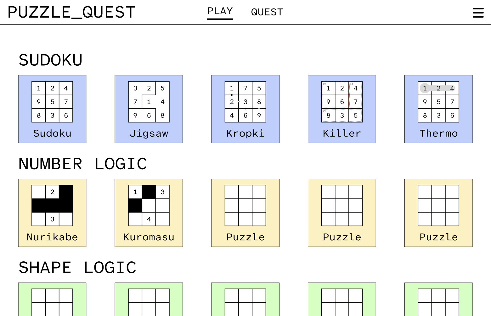
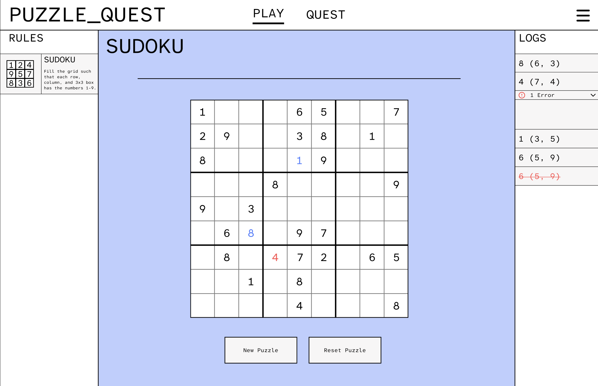

# Puzzle Quest — Planning Document

> Living document. Edit freely. This is the source of truth for what this site is going to become — use it to dump ideas, track features, and pin UI references so future Claude sessions can pick up context without re-deriving everything.

---

## 1. Vision

Puzzle Quest is a website that does two things for logic puzzles (Kurodoku, Nurikabe, Fillomino, Hitori, Reverse Minesweeper, etc.):

1. **Teach** the logical deduction patterns each puzzle uses, via curated "Quest" tracks (inspired by LeetQuest).
2. **Play** an endless supply of auto-generated puzzles at varying sizes and difficulties.

One framework, two modes (`/play` and `/quest`), shared puzzle definitions under the hood.

---

## 2. Target Architecture (decided)

- **Approach:** Restructure-in-place (option B from the planning convo). Same repo, new `src/puzzles/core/` abstraction, port Reverse-Minesweeper onto it, add new puzzle types as additional implementers.
- **DB:** _TBD — pending decision between SQLite+Turso, Supabase, or hybrid JSON+DB. See §8._
- **Puzzle generation:** offline batch script fills a DB pool. Web serves by ID via indexed SELECT. Never generates on request.
- **Quest content:** hand-authored JSON catalogs (one per puzzle type) with ordered lesson + puzzle sequences.

```
src/
  puzzles/
    core/                    # generic interfaces: PuzzleType, Move, Solver, Encoder
      index.ts               # barrel exports
      types.ts               # Coordinate, GridSize, Category, Grid<T>, PuzzleMeta, ValidationResult, Move<TCell>
      puzzle-type.ts         # PuzzleType<TCell> — main interface each puzzle implements
      solver.ts              # Solver<TCell>, SolverResult<TCell>
      encoder.ts             # PuzzleEncoder<TCell>
    sudoku/                  # reference implementation — wired into SudokuPage/Grid/Square
      sudoku-type.tsx        # sudokuType: PuzzleType<number | null>
    kurodoku/
    nurikabe/
    reverse-minesweeper/     # ported from current impl
    ...
  quests/
    engine.tsx
    catalog/
  app/
    play/[type]/[id]
    quest/[type]/[step]
```

---

## 3. Puzzle Types

Status legend: `shipped` / `in-progress` / `planned` / `idea`

| Type                 | Status      | Category       | Play | Quest | Generator | Notes |
|----------------------|-------------|----------------|------|-------|-----------|-------|
| Sudoku               | in-progress | Sudoku         | yes  |       | yes       | Sample puzzle for the new UI prototype. New page layout (rules sidebar + logs sidebar) lives at `/sudoku`. |
| Jigsaw               | in-progress | Sudoku         | yes  |       | yes       | Variant. Region generator + constraint-propagation puzzle gen. `/jigsaw` route. Custom rule icon (`jigsaw.png`). |
| Kropki               | planned     | Sudoku         |      |       |           | Variant. |
| Killer               | planned     | Sudoku         |      |       |           | Variant. |
| Thermo               | planned     | Sudoku         |      |       |           | Variant. |
| Nurikabe             | in-progress | Number Logic   | yes  |       | partial   | Existing `/area` route. Not yet reskinned. |
| Kurodoku             | in-progress | Number Logic   | yes  |       | yes       | Ported to new UI. Generator + constraint-propagation solver + PuzzleType factory. `/kurodoku` route uses three-column layout. Size selector (5–8). Custom rule icons (`no_adj_black.png`, `connected_white.png`, `viewpoint_white.png`). Old `/range` route deleted. |
| Reverse Minesweeper  | in-progress | Number Logic   | yes  | yes*  | no        | *existing puzzle_order.json is already quest-shaped. Ported to new UI with three-column layout, timer, logs sidebar, level selector, revert support. Hand-authored puzzles (87 levels). No generator. `/reverse-minesweeper` route uses `ReverseMinesweeperPage`. Legacy `ReverseMinesweeper.tsx` still in tree but unused. |
| Yin-Yang             | in-progress | Shape Logic    | yes  |       |           | Existing `/yin-yang` route. Not yet reskinned. |
| Queens               | in-progress | Line Logic     | yes  |       | yes       | Ported to new UI. Generator + PuzzleType factory. `/queens` route uses three-column layout. Size selector (5–9). |

_Add new rows as ideas arrive. Categories so far: **Sudoku** (light blue), **Number Logic** (light yellow/beige), **Shape Logic** (light green), **Line Logic** (light purple). More categories to come._

---

## 4. Feature Requirements

### 4.1 Free-play mode (`/play`)
- [ ] Landing page: pick puzzle type
- [ ] Per-type page: pick size + difficulty
- [ ] Puzzle board view (rendered from encoded clues)
- [ ] Timer
- [ ] Win detection + celebration state
- [ ] "Next puzzle" button — pulls next from pool (fair rotation, avoid duplicates)
- [ ] Resume in-progress attempt on refresh
- [ ] (Later) Leaderboard per puzzle
- [ ]

### 4.2 Quest mode (`/quest`)
- [ ] Per-type quest landing page showing lesson progression
- [ ] Lesson screen: text + diagram explaining one deduction rule
- [ ] Practice puzzle that forces use of that rule
- [ ] Validation that the user used the *right* pattern (not just got the answer) — _open question, see §9_
- [ ] Progress persistence per user
- [ ] Unlock gating — later lessons require earlier ones complete
- [ ]

### 4.3 Check / Reveal / Hint
- [ ] **Check button**: compares user grid against stored solution; logs result; disabled if most recent action already has visible validation errors
- [ ] **Reveal button**: appears after Check finds mistakes; highlights the "earliest" incorrect cell (oldest log entry for a currently-wrong cell) with red bg + border
- [ ] **Hint button**: appears after Check finds no mistakes; highlights the next cell the solver trace says to fill (first trace step whose cell is still empty) with gold bg + border
- [ ] **State machine**: button cycles Check → Reveal/Hint → Check on next user action
- [ ] **Solver trace**: logical solver (naked singles + hidden singles) records solve order at generation time; stored alongside puzzle + solution

### 4.4 Cross-cutting
- [ ] User auth (sign-in) — _required once user times / quest progress persist server-side_
- [ ] User profile page (stats, progress)
- [ ] Mobile responsive
- [ ]

### 4.5 Admin / Content tooling
- [ ] Pool-fill CLI script (`tsx scripts/generate-pool.ts --type kurodoku --size 15 --count 500`)
- [ ] Quest catalog editor (or just hand-edit JSON for now)
- [ ] Pool stats dashboard (how many puzzles per type/size/difficulty)
- [ ]

---

## 5. Non-functional Requirements

- [ ] Puzzle load time < 200ms (served from pool, not generated)
- [ ] Mobile-first responsive layout
- [ ] Keyboard shortcuts for power users
- [ ] Accessible (a11y: ARIA on grid, keyboard nav, color-blind safe palette)
- [ ] Deterministic puzzle rendering (same seed → same puzzle)
- [ ]

---

## 6. Roadmap / Phases

### Phase 1 — Framework & port (target: ~2 weeks)
- [x] Draft `src/puzzles/core/` interfaces (`PuzzleType`, `Move`, `Solver`, `Renderer`, `Encoder`)
- [x] Wire Sudoku onto `core/` interfaces (reference implementation proving the interfaces work with the new frontend)
- [ ] Pick DB (see §8) and set up schema + migrations
- [x] Port Reverse-Minesweeper onto `core/`
- [ ] Parity test: existing RM puzzles play identically

### Phase 1b — Jigsaw Sudoku variant
- [x] Region generator (`src/puzzles/jigsaw/region-generator.ts`) — perturb-from-standard-boxes algorithm: starts from 3×3 boxes, performs pairwise boundary swaps to create irregular contiguous regions of size 9
- [x] Jigsaw puzzle generator (`src/puzzles/jigsaw/jigsaw-generator.ts`) — solved grid via backtracking + clue removal with constraint-propagation uniqueness checker (bitmask candidates, MRV branching, node-bounded)
- [x] Jigsaw PuzzleType factory (`src/puzzles/jigsaw/jigsaw-type.tsx`) — `createJigsawType(regionMap)` returns `PuzzleType<number | null>` with region map in closure; handles borders, validation, related cells, region coloring (9-color pastel palette)
- [x] Generalize SudokuGrid to accept a `PuzzleType` prop (reuse for Jigsaw instead of duplicating)
- [x] Pencil note cleanup generalized to use `getRelatedCells()` from PuzzleType (works for both standard and jigsaw regions)
- [x] JigsawPage (`src/components/JigsawPage.tsx`) — three-column layout, generates region map + puzzle, creates jigsawType instance, retries on generation failure
- [x] Rule icon (`public/rule_icons/jigsaw.png`) — custom icon created and wired into `jigsaw-type.tsx`
- [x] Wire into routing (`/jigsaw`) and PuzzleHome (Sudoku category card)
- [x] Update PLAN.md status

### Phase 1c — Check / Reveal / Hint system

A tri-state button in the puzzle action bar that cycles through Check → Reveal (if errors) or Check → Hint (if no errors). Resets to Check on any user grid action.

**Prerequisites: solution + solver trace storage**
- [x] **Generators return solutions.** Modify `generateValidSudoku` to return `{ puzzle, solution }` instead of just `puzzle`. Modify `generateJigsawPuzzle` to return `{ puzzle, regionMap, solution }`. Update SudokuPage and JigsawPage to store `solution` in state alongside the puzzle.
- [x] **Logical solver with trace.** Create `src/puzzles/sudoku/sudoku-solver.ts` — a constraint-propagation solver that records every cell it resolves, in order, as a `SolverStep[]`. Techniques: naked singles (cell has one candidate) + hidden singles (value has one possible cell in a row/col/box/region). Accepts generic constraint groups so it works for both standard Sudoku and Jigsaw regions. Run after puzzle generation; store the trace in page state.
- [x] **Core types.** Add `SolverStep { cell: Coordinate; value: number; technique: string; relatedCells: readonly Coordinate[] }` to `src/puzzles/core/types.ts`. Extend `SolverResult<TCell>` with optional `trace: readonly SolverStep[]`. (`relatedCells` added in Phase 2b.)

**Check button**
- [x] **Check logic (page-level).** Compare every non-locked, non-empty cell in the current grid against the stored solution. A cell is "wrong" if its value ≠ the solution value. Add a special log entry: `"✓ No mistakes found"` or `"✗ N mistake(s) found"`.
- [x] **Disable rule.** Button is disabled when the most recent log entry (the last user action) has validation errors (the `errors` array on the LogEntry is non-empty). This avoids redundant checks when the user can already see something is wrong.

**Button state machine**
- [x] **Tri-state: `'check' | 'reveal' | 'hint'`.** Default is `'check'`. After pressing Check: if mistakes → `'reveal'`; if no mistakes → `'hint'`. Any user grid action (place / replace / delete), Reset, or New Puzzle resets to `'check'`.

**Reveal button (appears when state = `'reveal'`)**
- [x] **Find earliest incorrect cell.** Algorithm: (1) collect all cells that are currently wrong (value ≠ solution, value ≠ empty). (2) For each wrong cell, find the first (oldest) log entry that touched that cell. (3) Among those, pick the cell whose first log entry has the smallest index — that's the "earliest." (4) If a cell is wrong but has no log entry (shouldn't happen normally), ignore it. Skips non-grid log entries (check/reveal/hint logs with row=-1).
- [x] **Highlight on grid.** Pass `revealCell: Coordinate | null` to SudokuGrid. SudokuSquare renders it with a red background (`rgba(255,60,60,0.45)`) and red border. Highlight clears on next user action.
- [x] **Log entry.** Pressing Reveal adds `"⚑ Earliest mistake: (row, col)"` to the log and resets button state to `'check'`.

**Hint button (appears when state = `'hint'`)**
- [x] **Find next hint cell.** From the stored solver trace, find the first `SolverStep` whose cell is still empty (null) in the current grid. That's the cell the user should look at next.
- [x] **Highlight on grid.** Pass `hintCell: Coordinate | null` to SudokuGrid. SudokuSquare renders it with a gold/yellow highlight (`rgba(255,210,60,0.45)`) and gold border. Highlight clears on next user action.
- [x] **Log entry.** Pressing Hint adds `"💡 Hint: look at (row, col)"` to the log and resets button state to `'check'`.

**Grid integration**
- [x] **SudokuGrid new props.** Add optional `revealCell` and `hintCell` props (both `Coordinate | null`). These are rendered as additional highlight layers in SudokuSquare, above existing selection/related highlights. Both use the dual-highlight strategy already in place (CSS class for standard tiles, cssOverlay for region-colored tiles).
- [x] **SudokuSquare new highlight types.** Add `reveal` (red bg + red border) and `hint` (gold bg + gold border) visual states. These take precedence over `related` but not over `selected`.

**Shared hook**
- [x] **Extract `useCheckRevealHint` hook.** The Check/Reveal/Hint state machine + logic is identical between SudokuPage and JigsawPage (and future puzzle pages). Extract into `src/components/useCheckRevealHint.ts` so all pages share the same implementation. Inputs: current grid, solution, solver trace, logs. Outputs: button state, button label, disabled flag, highlighted cell, handler.

### Phase 1d — Queens puzzle port
- [x] Queens generator (`src/puzzles/queens/queens-generator.ts`) — generates a valid queen placement via backtracking (no two in same row/col/diagonal-adjacent), then flood-fills contiguous regions seeded from queen positions with random frontier expansion. Validates uniqueness by exhaustive count. Retries region generation up to 100× per placement.
- [x] Queens PuzzleType factory (`src/puzzles/queens/queens-type.tsx`) — `createQueensType(regionMap, gridSize)` returns `PuzzleType<number>` (0=empty, 1=dot, 2=queen). Region coloring (10-color palette), black borders at region boundaries, inner-corner patches. Validation: one queen per row/col/region, no diagonal-adjacent queens. Related cells: row + col + diagonals + region peers.
- [x] QueensGrid (`src/components/QueensGrid.tsx`) — drag interaction model (click-to-dot, click-dot-to-queen, click-queen-to-clear). Auto-dot computation marks cells blocked by placed queens. Drag-to-paint dots across multiple cells. Emits `QueensAction` with place/delete types.
- [x] QueensSquare (`src/components/QueensSquare.tsx`) — renders via PuzzleSquare CSS tiles. Shows dot (small circle) or queen (♛ glyph) overlays. Highlight states: selected, related, invalid (red), reveal (red overlay + border), hint (gold overlay + border).
- [x] QueensPage (`src/components/QueensPage.tsx`) — three-column layout. Size selector (5×5 to 9×9). Log/revert/reset. Inverse-action log pop. Uses dual grid state: `initialGrid` (passed to QueensGrid, only changes on new/reset/revert) and `currentGrid` (tracks live state for the check hook, updated on every action — avoids triggering QueensGrid's auto-dot reset effect).
- [x] Wire into routing (`/queens`) and PuzzleHome (Line Logic category card)
- [x] Check/Reveal/Hint integration — reuses `useCheckRevealHint` hook by converting Queens data: grid cells mapped to `2|null` (only queens matter for comparison), solution `[row,col][]` expanded into a full grid. No solver trace (hint scans row-by-row for next unplaced queen). Button wired into action bar; all state changes (action/revert/reset/new) call `resetToCheck()`.

### Phase 1e — Timer & puzzle completion detection
- [x] **`useTimer` hook** (`src/components/useTimer.ts`) — shared hook with `start()` (resets to 0, begins interval) and `stop()` (freezes display). Uses `setInterval` at 200ms polling `Date.now()` delta for accurate elapsed seconds. Auto-cleans up interval on unmount.
- [x] **Timer display.** Rendered as `<span className="pq-puzzle-timer">` on the right side of a new `<div className="pq-puzzle-header">` flex row, opposite the puzzle title (`<h1>`), above the `<hr>` divider. Format: `M:SS`.
- [x] **Timer starts after puzzle is visible.** Each page tracks a `puzzleKey` counter (incremented in `handleNewPuzzle`). A `useEffect` watching `puzzleKey` calls `startTimer()` — this ensures the timer begins only after React commits the new puzzle state to the DOM.
- [x] **Timer resets on Reset.** `handleReset` calls `startTimer()` directly (puzzle is already visible, just resetting progress).
- [x] **Puzzle completion detection.** `isComplete` is a `useMemo` comparing `currentGrid` against the stored `solution`. For Sudoku/Jigsaw: every cell matches. For Queens: `checkGrid` (queens mapped to `2|null`) matches `solutionGrid`.
- [x] **Timer stops on completion.** A `useEffect` watching `isComplete` calls `stopTimer()` when true. Timer display freezes at the completion time.
- [x] **Completion message.** When `isComplete` is true, a centered green `<p className="pq-puzzle-complete">Puzzle Complete</p>` appears between the `<hr>` divider and the puzzle board.
- [x] **CSS.** `.pq-puzzle-header` (flex row, space-between, baseline-aligned), `.pq-puzzle-timer` (monospace, 1.2rem, #333), `.pq-puzzle-complete` (centered, 1.3rem, bold, green #2a7d2a).
- [x] **Integrated into all three pages:** SudokuPage, JigsawPage, QueensPage.

### Phase 2 — Kurodoku port & solver rewrite
- [x] **Rename Range → Kurodoku.** All references renamed: component files, route, PuzzleHome card, NavBar link. Old `/range` route and `Range.tsx`/`RangeGrid.tsx`/`RangeSquare.tsx` still exist as legacy — safe to delete.
- [x] **Kurodoku PuzzleType factory** (`src/puzzles/kurodoku/kurodoku-type.tsx`) — `createKurodokuType(values, rows, cols)` returns `PuzzleType<number>` (0=blank, 1=black, 2=white). Values (clue numbers) baked into closure. Validation checks adjacent blacks, white connectivity, and clue correctness (visible count vs. connected white count). Tiles have outer black borders and inner gray borders (no region coloring). Related cells: entire row + column. `formatMoveLabel`: `■` for black, `□` for white, `✕` for delete.
- [x] **KurodokuGrid** (`src/components/KurodokuGrid.tsx`) — click-cycling interaction model. Left click cycles blank→black→white→blank (`(old+1)%3`), right click cycles in reverse (`(old+2)%3`). Locked clue cells ignore clicks. Emits `KurodokuAction` with type/row/col/value/previousValue/errors/gridSnapshot. Validation + related-cell highlighting via PuzzleType interface.
- [x] **KurodokuSquare** (`src/components/KurodokuSquare.tsx`) — renders via PuzzleSquare with cell-state-driven background (gray `#BDBDBD` / black `#000` / white `#FFF`). Clue numbers displayed as bold text. Highlight overlays: selected (blue), related (light blue), invalid (red border), reveal (red bg + border), hint (gold bg + border). Right-click handled via `onContextMenu`.
- [x] **KurodokuPage** (`src/components/KurodokuPage.tsx`) — three-column shell at `/kurodoku`. Size selector dropdown (5–8). Timer + completion detection via `useTimer` and `isComplete` useMemo comparing `currentGrid` vs stored `solution`. Log/revert/reset/inverse-action behavior matching QueensPage pattern. Category background: beige `#f1e7c0`. Check/Reveal/Hint button not yet wired (placeholder `revealCell={null} hintCell={null}`).
- [x] **Kurodoku solver rewrite** (`src/puzzles/kurodoku/kurodoku-generator.ts`) — complete rewrite of the uniqueness checker. Old solver (`efficientlySolveRangePuzzle`) had critical bugs: single-pass deduction (not iterated to fixed point), guessing phase only tried black (never white), grid mutation without restoration, `addMinimumWhites` set cells to black, `isAllWhiteConnected` started DFS from wrong cell. New solver uses **constraint propagation + backtracking**: 6 deduction rules iterated to a fixed point (clue cells → white, adjacent-to-black → white, max-visibility → fill whites, white-run-complete → block with black, connectivity preservation, over-visibility → force black), then clean backtracking that deep-copies the grid at each branch, tries both black and white, sums solutions, short-circuits at 2. Verified with independent brute-force counter: 10/10 pass at 5×5, 5/5 pass at 6×6.
- [x] **Generator** returns `{ values: (number|null)[][], solution: number[][] }`. Solution captured before clue removal. Clue removal loop shuffles clue cells, removes one at a time, restores if `countSolutions !== 1`.
- [x] **Route** (`src/app/kurodoku/page.tsx`) — renders KurodokuPage.
- [x] **PuzzleHome** — card renamed from "Kuromasu" to "Kurodoku", link changed from `/range` to `/kurodoku`.
- [x] **CSS** — added `.pq-puzzle-main--kurodoku { background: #f1e7c0 }`.
- [x] Check/Reveal/Hint integration — wired `useCheckRevealHint` hook into KurodokuPage. Converts Kurodoku grid (0=blank→null, 1=black, 2=white) to `(number|null)[][]` for the hook. Solver trace now generated via `solveKurodokuWithTrace`. Button cycles Check→Reveal/Hint, resets on action/revert/reset/new.
- [ ] Pool-fill CLI
- [x] Delete legacy Range files (`Range.tsx`, `RangeGrid.tsx`, `RangeSquare.tsx`, `src/app/range/`) — removed, no remaining references.
- [x] Custom rule icons — `no_adj_black.png` (black cells rule), `connected_white.png` (white cells rule), `viewpoint_white.png` (clue numbers rule). Wired into `kurodoku-type.tsx`. No single `kurodoku.png` needed.

### Phase 2b — Solve Next Cell (developer tool)

A developer button that auto-solves one cell at a time, logging the solver's technique and related cells used in the deduction. Designed for verifying puzzle generation and solver correctness.

**Core types extension**
- [x] **SolverStep extended.** Added `relatedCells: readonly Coordinate[]` to `SolverStep` interface in `src/puzzles/core/types.ts`. Every solver step now records which cells were used to reach the deduction.

**Sudoku solver trace enrichment**
- [x] **ConstraintGroup labels.** Added `label: string` to `ConstraintGroup` interface in `src/puzzles/sudoku/sudoku-solver.ts`. Builders (`buildSudokuGroups`, `buildJigsawGroups`) now label each group (e.g. "Row 3", "Col 5", "Box 7", "Region 2").
- [x] **Naked Single related cells.** For each naked single, records one peer per eliminated value — walks groups until it finds a filled peer whose value matches each needed digit (2–9 when solving a 1), building a minimal set that explains the deduction. Not all filled peers, just the ones that eliminate each candidate.
- [x] **Hidden Single related cells.** For each hidden single in a group, finds external peers (cells outside the group) that contain the hidden value and thereby prevent it from appearing in the other empty cells of the group. Technique string includes the group label (e.g. "Hidden Single in Row 3").

**Kurodoku solver with trace**
- [x] **New file: `src/puzzles/kurodoku/kurodoku-solver.ts`** — constraint-propagation solver that produces a `SolverStep[]` trace. Replicates the same 6 deduction rules as the generator's solver but records each cell assignment with its technique name and related cells.
- [x] **Technique names:** "Clue Cell" (cells with clues → white), "Adjacent to Black" (neighbors of black → white, related: the black cell), "Full Visibility" (max visible = clue → blanks become white, related: the clue cell), "Run Complete" (white run = clue → block with black, related: clue cell + run cells), "Connectivity" (must be white to maintain connection, related: neighboring non-black cells), "Over-Visibility" (would exceed clue → black, related: the violated clue cell).
- [x] **KurodokuPage integration.** `handleNewPuzzle` calls `solveKurodokuWithTrace(values, n, n)` and stores the trace in `solverTraceRef`. Trace is passed to `useCheckRevealHint` hook (replacing the previous empty array).

**Shared hook extension**
- [x] **`getNextSolveStep()` added to `useCheckRevealHint`.** Returns the next `SolverStep` from the solver trace where the cell is still empty (null). Falls back to a `{ technique: 'Solution', relatedCells: [] }` step for cells not covered by the trace (e.g. if propagation alone couldn't fully solve).

**Log details rendering**
- [x] **`LogEntry.details` field.** Added optional `details?: string[]` to `LogEntry` interface. Each detail line is rendered in a collapsible dropdown (blue "i" badge + "Details" label), similar to the error dropdown pattern.
- [x] **LogsSidebar rendering.** New `openDetails` state + `toggleDetails` handler. Detail dropdown styled with blue color scheme (`.pq-log-detail-toggle`, `.pq-log-detail-badge`, `.pq-log-details`).

**Page integration**
- [x] **SudokuPage.** `handleSolveNext`: gets next step, updates `generatedSudoku` + `currentGrid` with the solved value, marks cell as locked, logs `"🔧 value (row, col)"` with technique + related cells as collapsible details.
- [x] **JigsawPage.** Same pattern as SudokuPage.
- [x] **KurodokuPage.** Same pattern, with Kurodoku-specific value labels (■ for black, □ for white).
- [x] **Button placement.** `"Solve Next Cell"` button on the far right of the action bar, styled with `.pq-btn--dev` (dashed gold border, yellow background) to visually distinguish it as a developer tool.

### Phase 2c — Clickable log highlighting

Clicking a log entry highlights the relevant cells on the grid. The placed/solved cell and its related cells get a blue highlight; error cells get a red highlight. Clicking the same log toggles the highlight off; clicking a different log replaces it.

**LogsSidebar extensions**
- [x] **`LogEntry` extended.** Added `relatedCoords?: Coordinate[]` and `errorCoords?: Coordinate[]` fields to `LogEntry` in `LogsSidebar.tsx`. These carry structured coordinate data alongside the human-readable `errors` and `details` strings.
- [x] **Click handling.** Added `selectedLogId?: number | null` and `onLogClick?: (id: number) => void` props. The `.pq-log` div is clickable; revert button, error toggle, and detail toggle use `e.stopPropagation()` to avoid triggering log selection.
- [x] **Selected visual.** `.pq-log-group--selected` class (blue outline + light blue background) applied to the selected log group.

**Square-level highlight props**
- [x] **SudokuSquare.** Added `logHighlight?: boolean` and `logError?: boolean` props. For standard tiles (no region color): CSS classes `.square.log-highlight` (blue bg) and `.square.log-error` (red bg). For region-colored tiles (Jigsaw): cssOverlay backgrounds (`rgba(100,160,255,0.4)` / `rgba(255,80,80,0.4)`). Log highlights take precedence over selection/related highlights but not over reveal/hint.
- [x] **KurodokuSquare.** Same `logHighlight`/`logError` props. Rendered as cssOverlay backgrounds. Takes precedence over selected/related highlights in the overlay chain.

**Grid-level props**
- [x] **SudokuGrid.** Added `logHighlightCells?: Set<string>` and `logErrorCells?: Set<string>` props. Passed through to each SudokuSquare via `"row,col"` key lookup.
- [x] **KurodokuGrid.** Same props, same pattern.

**Page-level wiring**
- [x] **SudokuPage, JigsawPage, KurodokuPage.** Each page adds:
  - `selectedLogId` state with `handleLogClick` (toggle on re-click, replace on different click).
  - `useMemo` computing `logHighlightCells` (cell + `relatedCoords` from selected log) and `logErrorCells` (`errorCoords` from selected log).
  - `errorCoords` populated from `action.errors` when creating normal action log entries.
  - `relatedCoords` populated from `step.relatedCells` when creating solver step log entries.
  - `selectedLogId` and `onLogClick` passed to `LogsSidebar`.
  - `logHighlightCells` and `logErrorCells` passed to the grid component.
  - State cleared on new puzzle and reset.

**CSS**
- [x] `.square.log-highlight` — `background-color: rgba(100, 160, 255, 0.4)`, `z-index: 11`.
- [x] `.square.log-error` — `background-color: rgba(255, 80, 80, 0.4)`, `z-index: 11`.

### Phase 2d — Solver related cells fix & primary cell highlight

Fixes hidden single related cells to show the correct deduction context, adds a distinct highlight for the solved cell vs. related cells when clicking log entries, and ensures all generated puzzles are fully solvable by the logical solver (no "Solution" fallback).

**Hidden single related cells rewrite**
- [x] **Correct related cells.** For a hidden single of value V in group G, the related cells are now all placed cells with value V that are peers of any cell in G (i.e., they share a row, column, box, or region with cells in G). These are the cells that block V from going anywhere else in G, directly explaining the deduction.
- [x] **Previous approach (removed).** The old code tried to find external blocker peers for each empty cell in the group — this produced incomplete or empty related cells, and could circularly include the solved cell itself (since `grid[idx] = val` was set before computing related cells).
- [x] **Works for Jigsaw.** Since the algorithm iterates through each cell in the constraint group and checks all its peer groups, it naturally handles irregular jigsaw regions — it finds all cells with the target value that share a row, column, or region with any cell in the constraint group.

**Primary cell highlight (log click)**
- [x] **Separate primary vs. related highlights.** When clicking a solver log entry, the solved cell now gets a darker blue highlight (same as the "selected" color), while related cells keep the lighter blue. Previously both used the same `logHighlight` color.
- [x] **`logPrimary` prop chain.** New `logPrimary` boolean prop added to `SudokuSquare` and `KurodokuSquare`. New `logPrimaryCells` (`Set<string>`) prop added to `SudokuGrid` and `KurodokuGrid`. Passed through identically to `logHighlight`/`logHighlightCells`.
- [x] **Page-level separation.** All three pages (`SudokuPage`, `JigsawPage`, `KurodokuPage`) now compute `logPrimaryCells` (just the entry cell) separately from `logHighlightCells` (just the `relatedCoords`, excluding the primary cell). Previously both went into a single `logHighlightCells` set.
- [x] **CSS.** `.square.log-primary` — `background-color: rgb(196, 196, 255)` (same as `.square.selected`), `z-index: 11`. For region-colored tiles (Jigsaw, Kurodoku): cssOverlay `rgba(140, 140, 255, 0.4)` (same as the selected overlay). Takes precedence over `logHighlight` in the highlight chain.

**Logical solvability guarantee**
- [x] **Jigsaw generator** (`jigsaw-generator.ts`). During clue removal, after verifying uniqueness via `countSolutionsBounded`, the generator now also runs `solveWithTrace` and checks that the trace covers all empty cells. If the removal would require techniques beyond naked singles + hidden singles, the clue is kept. Ensures every cell has a proper solver trace entry — no more "Solution" fallback technique.
- [x] **Sudoku generator** (`sudokuGenerator.ts`). Same logical solvability check added. Before this fix, ~20% of generated Sudoku puzzles had cells that fell back to "Solution" (e.g., 46 out of 56 empty cells untraced). Now 0 fallbacks across all tested puzzles.
- [x] **Trade-off.** Puzzles may retain slightly more clues (since removals requiring advanced techniques are rejected), but every cell is guaranteed to have a human-readable deduction step with technique name and related cells.

### Phase 2e — Reverse Minesweeper port to core/

Port the existing Reverse Minesweeper (87 hand-authored puzzles) onto the `core/` PuzzleType interface and three-column layout. No generator needed — puzzles loaded from `puzzles.json` via `puzzle_order.json`.

**PuzzleType**
- [x] **`src/puzzles/reverse-minesweeper/reverse-minesweeper-type.tsx`** — factory `createReverseMinesweeperType(rows, cols)` returns `PuzzleType<number>`. Lightweight: provides identity, rules (Numbers / Drag & Drop / Walls), cell size (64), and related cells (8 neighbors). Validation, interaction, and rendering handled at the Grid/Page level due to RM's unique drag-and-drop model and compound cell state.

**Grid modifications**
- [x] **Exported types.** `RMSnapshot` (all 6 arrays: walls, blocks, values, operations, blockTypes, blockPlanes) and `RMAction` (type swap/wallbreak, from/to coords, post-action snapshot, solved flag).
- [x] **Action emission.** `onAction` callback emitted after each drag-drop with full `RMSnapshot` for revert support. `deepCopySnapshot` helper deep-copies all 6 arrays.
- [x] **Solved notification.** `onSolvedChange` callback fires on initial load and after each action. Solved = all value cells are in the correct grid.
- [x] **Firebase decoupled.** `markLevelCompleted` call removed from Grid; moved to Page-level `useEffect` watching solved state.

**Page**
- [x] **`src/components/ReverseMinesweeperPage.tsx`** — three-column layout. Level selector (Previous / native `<select>` dropdown / Next) with difficulty colors (green/yellow/red/purple/rainbow for 87 levels). Timer via `useTimer`. Completion detection + "Puzzle Complete" message. Logs sidebar with revert support (snapshots store full 6-array state). Reset button restores original puzzle state. Mode toggle (Normal/Value). Firebase level completion on solve.
- [x] **Puzzle parsing.** `parsePuzzle(name)` moved from legacy `ReverseMinesweeper.tsx` to Page. Handles all optional fields (operations, block_types, block_planes) with correct defaults.

**Routing & CSS**
- [x] **`src/app/reverse-minesweeper/page.tsx`** — simplified to render `ReverseMinesweeperPage`.
- [x] **CSS.** `.pq-puzzle-main--reverse-minesweeper { background: #f1e7c0 }` (beige, Number Logic category).
- [x] **Legacy compat.** `ReverseMinesweeper.tsx` updated to compile with new Grid interface (removed `level_id`/`user_id` props). Still in tree but unused — safe to delete.

**Not changed**
- `ReverseMinesweeperSquare.tsx` — 476-line renderer (SVG wallbreakers, multi-cell blocks, operation labels, right-click popup) preserved unchanged. Too specialized for PuzzleSquare CSS rendering.
- `puzzles.json` / `reverse_minesweeper_puzzle_order.json` — puzzle data unchanged.
- No solver trace, no Check/Reveal/Hint (RM shows correct/incorrect inline via green/red value text).

### Phase 2f — UI cleanup

- [x] **Kurodoku outer border.** Added `.kurodoku-grid` to `.pq-puzzle-board .sudoku-grid` CSS rule so Kurodoku gets the same `border: 2px solid black` grid wrapper as Sudoku/Jigsaw.
- [x] **Jigsaw rule icon.** Replaced `sudoku.png` placeholder with custom `jigsaw.png` in `jigsaw-type.tsx`.
- [x] **Kurodoku rule icons.** Replaced all three `sudoku.png` placeholders with per-rule icons: `no_adj_black.png` (black cells), `connected_white.png` (white cells), `viewpoint_white.png` (clue numbers). Rule headings updated to match icons.

### Phase 3 — Quest engine (target: ~1 week)
- [ ] Quest state machine
- [ ] Reverse-Minesweeper quest ported from existing puzzle_order
- [ ] Kurodoku quest (hand-authored lessons)

### Phase 4 — User data
- [ ] Auth
- [ ] Attempts / times table
- [ ] Leaderboards (optional)

### Phase 5 — Nurikabe (and beyond)
- [ ] Nurikabe propagators + generator
- [ ] Nurikabe quest
- [ ]

---

## 7. Ideas / Backlog (unstructured parking lot)

_Dump raw ideas here. Move them into §4 when they firm up._

-

---

## 8. Open Technical Decisions

- **DB choice:** SQLite+Turso vs. Supabase Postgres vs. hybrid. Hinges on: (a) do I want OAuth auth in the next month? (b) do existing Reverse-Minesweeper puzzles stay in JSON?
- **Encoding format for `clues_blob` / `solution_blob`:** packed bits vs. base64 JSON vs. run-length. Whichever round-trips fastest on the client.
- **Pattern-usage validation in Quest mode:** do we just check the final answer, or do we check that the user made the *intended* deduction? Latter is much harder.
- **Hint system UX:** reveal next deduction step? Highlight the cell? Show the rule name?

---

## 9. Open Questions / To Discuss

-

---

## 10. UI Screenshots & References

_Drop screenshots into `docs/images/` and reference them below with a short note on what you want to capture/emulate. Screenshots of competitor sites, inspiration from other apps, or sketches of your own ideas all welcome._

### Puzzle home page (target)

Notes:
- Top nav: `PUZZLE_QUEST` logo on the left, `PLAY` / `QUEST` tabs centered (active tab gets an underline), hamburger menu on the right.
- Body: each category renders as a labeled row (e.g. `SUDOKU`, `NUMBER LOGIC`, `SHAPE LOGIC`, `LINE LOGIC`) of 5 colored cards.
- Card colors per category:
  - Sudoku → light blue (`#c9d2f2`)
  - Number Logic → light yellow/beige (`#f1e7c0`)
  - Shape Logic → light green (`#c8e8c2`)
  - Line Logic → light purple (`#d8c8ec`)
- Each card has a mini grid preview on top and the puzzle name below.
- Monospace `Courier New` typography matches the pencil-paper aesthetic.

### Sudoku puzzle page (target)

Notes:
- Top nav stays on every puzzle page.
- Three-column layout: **left rules sidebar**, **center puzzle pane** (background tinted to the category color — sudoku=light blue), **right logs sidebar**.
- Rules sidebar header `RULES`, then a list of rule cards: small icon/preview on the left, bold heading + body text on the right.
- Center pane: puzzle title (`SUDOKU`), horizontal divider, the puzzle board, then `New Puzzle` and `Reset Puzzle` buttons at the bottom.
- Logs sidebar header `LOGS`, then a chronological list of action entries (e.g. `8 (6, 3)`). Overwriting/clearing a cell strikes through earlier entries for that cell. Errors caused by an action collapse into a `! N Error(s)` dropdown row beneath the log entry.

### LeetQuest inspiration
_Screenshots of LeetQuest quest flow — add here to pin the UX you're trying to match for Quest mode._

### puzzle-*.com play mode
_Screenshots of how kurodoko.com / puzzle-nurikabe.com present their free-play experience._

### Current Puzzle Quest
_Screenshots of the current Reverse-Minesweeper UI — useful for parity-testing the port._

---

## 10b. UI Implementation Status

### Shipped in current prototype (`main`)
- `src/components/TopNav.tsx` — top nav with `PUZZLE_QUEST` logo, `PLAY` / `QUEST` tabs (auto-detects active tab from path), hamburger button (UI only, no menu yet). Padding reduced to 0.5rem vertical.
- `src/components/PuzzleHome.tsx` — categorized home page rendered at `/`. Pulls categories + entries from a static `CATEGORIES` array; entries with no `to` render as disabled placeholders.
- `src/components/PuzzleCard.tsx` + `src/components/MiniGrid.tsx` — colored cards with monospaced mini-grid previews. MiniGrid still used by PuzzleHome; no longer used by SudokuPage.
- `src/components/PuzzleSquare.tsx` — generic tile-rendering framework supporting both PNG image tiles (`baseTile`/`overlays`) and CSS-only tiles (`cssBase`/`cssOverlays`). Borders rendered as **inset box-shadow** (avoids CSS border miter/trapezoid artifacts). Black borders are sorted first in the shadow list so they always render on top of gray borders. **Inner-corner patches**: `CssLayer` supports an optional `cornerPatches` array of `CornerPatch { corner, size, color }` — small absolutely-positioned divs rendered at cell corners to fill gaps where two region-boundary borders meet at an inner corner of an irregular region. Exports `CssLayer`, `BorderConfig`, `CornerPatch` interfaces for other games to reuse.
- `src/puzzles/core/` — generic puzzle interfaces. `PuzzleType<TCell>` is the main interface each puzzle implements, providing identity (id, name, category), rendering (getTile, getRelatedCells), validation (validate), move classification (classifyMove, formatMoveLabel), and data helpers (getEmptyCell, getLockedCells). Also defines `Solver<TCell>`, `PuzzleEncoder<TCell>`, and shared types (`Coordinate`, `GridSize`, `Grid<T>`, `Move<TCell>`, `ValidationResult`, etc.).
- `src/puzzles/sudoku/sudoku-type.tsx` — reference `PuzzleType<number | null>` implementation. Contains Sudoku-specific validation (row/col/3x3 box duplicate detection), tile generation (black borders at box boundaries, gray elsewhere), related cell computation, and move label formatting. Exported as `sudokuType`.
- `src/components/sudokuTiles.ts` — **legacy, no longer imported**. Tile generation now handled by `sudokuType.getTile()`. Safe to delete.
- `src/components/SudokuSquare.tsx` — renders via PuzzleSquare with CSS tiles. Cell size received as `cellSize` prop (via SudokuGrid). **Dual highlight strategy**: if the tile has no `background` (standard Sudoku), highlights use CSS classes (`.square.selected`, `.square.related`, `.square.same-number`). If the tile has a `background` (Jigsaw region colors), highlights are applied as semi-transparent `cssOverlay` layers rendered above the region color base — selected (`rgba(140,140,255,0.4)`), same-number (`rgba(120,120,255,0.45)`), related (`rgba(160,160,255,0.25)`). No browser focus outline.
- `src/components/SudokuGrid.tsx` — accepts optional `puzzleType` prop (defaults to `sudokuType`). `GRID_SIZE` and `CELL_SIZE` derived from the puzzle type. Validation, related-cell highlighting, move classification, and tile generation all go through the `PuzzleType` interface. Pencil-note cleanup (`checkNotes`) now uses `getRelatedCells()` so it works for both standard and jigsaw regions. Emits `SudokuAction` with three types: `place`, `replace`, `delete` (with `previousValue` for undo support).
- `src/components/SudokuPage.tsx` — three-column shell at `/sudoku`. Rules, title, and CSS class driven by `sudokuType.rules`, `sudokuType.name`, and `sudokuType.id`. Locked cells via `sudokuType.getLockedCells()`. Empty grid via `sudokuType.getEmptyCell()`. Log label formatting via `sudokuType.formatMoveLabel()`. **Inverse log detection**: if an action is the exact inverse of the most recent log (same cell, swapped value/previousValue), pops the log instead of appending.
- `src/components/RulesSidebar.tsx` — generic rules sidebar accepting `Rule[]` with icon (ReactNode), heading, and body.
- `src/components/LogsSidebar.tsx` — generic logs sidebar with per-action error dropdown, revert button (only on entries with an `actionType` — check/reveal/hint messages have no revert), and **scrollable list** (`overflow-y: auto`). Auto-scrolls to the bottom when new entries are added (`useRef` + `useEffect` on `entries.length`). Delete entries show strikethrough on the number portion only (not coordinates or revert button).
- `src/App.css` — compact layout: page `height: 100vh` with `overflow: hidden` (constrains page to viewport so logs sidebar scrolls internally instead of expanding the page), nav padding 0.5rem, main padding 1rem, title 1.5rem, gaps 0.5rem. `.square` has `outline: none` (no focus ring). Highlight classes use `.square.selected` / `.square.related` / `.square.same-number` for proper specificity over `.square`'s white background. Media query breakpoint lowered to **700px**. Logs sidebar is flex column with scrollable list.
- `public/rule_icons/sudoku.png` — rule icon asset for Sudoku.
- `public/tiles/` — directory structure created for future PNG tile assets (subdirs: `sudoku/base/`, `jigsaw/base/`, `killer/overlay/`, `sweeper/base/`). Currently empty; CSS rendering is used instead.
- `src/components/UserProvider.tsx` — no longer renders the legacy `NavBar`. Each new page brings its own `TopNav`.
- All game square sizes updated to match PuzzleSquare framework (previously 80px, now 64px for non-Sudoku games via their respective Grid/Square components).

- `src/puzzles/jigsaw/region-generator.ts` — generates irregular 9×9 region maps. Starts from standard 3×3 boxes, performs ~40-70 pairwise boundary cell swaps (maintains contiguity + equal sizes). Fast (~10ms).
- `src/puzzles/jigsaw/jigsaw-generator.ts` — `generateSolvedJigsaw(regionMap)` fills grid via backtracking (~100ms). `generateValidJigsaw(solved, regionMap)` removes clues with constraint-propagation uniqueness checker (bitmask candidates, MRV branching, node-bounded at 50k nodes per check). `generateJigsawPuzzle(regionMap)` retries up to 10 times. Typical total time: 0.5-2.5s.
- `src/puzzles/jigsaw/jigsaw-type.tsx` — factory `createJigsawType(regionMap)` returns `PuzzleType<number | null>`. Region map baked into closure. Tiles have colored backgrounds (9-color pastel palette) and black/gray borders at region boundaries. **Inner-corner detection**: `getTile` checks all four diagonal neighbors — if both adjacent cells are in the same region but the diagonal is not, adds a `CornerPatch` (black, BORDER_WIDTH × BORDER_WIDTH) to fill the gap. Validation checks rows, columns, and jigsaw regions. Uses `sudoku.png` as placeholder rule icon.
- `src/components/JigsawPage.tsx` — three-column shell at `/jigsaw`. Creates jigsawType per puzzle via factory. Retries up to 5 times with new region maps on generation failure. Same log/revert/reset/pencil behavior as SudokuPage.
- `src/app/jigsaw/page.tsx` — route for `/jigsaw`, renders JigsawPage.
- `src/components/PuzzleHome.tsx` — Jigsaw card now links to `/jigsaw`.

- `src/puzzles/core/types.ts` — added `SolverStep { cell: Coordinate; value: number; technique: string }`.
- `src/puzzles/core/solver.ts` — extended `SolverResult<TCell>` with optional `trace: readonly SolverStep[]`.
- `src/puzzles/sudoku/sudoku-solver.ts` — logical constraint-propagation solver with trace. Techniques: naked singles + hidden singles. Accepts generic `ConstraintGroup[]` so it works for both standard Sudoku (`buildSudokuGroups()`) and Jigsaw (`buildJigsawGroups(regionMap)`). `solveWithTrace(puzzle, groups)` returns `SolverStep[]` recording the order cells are resolved.
- `src/components/sudokuGenerator.ts` — `generateValidSudoku` now returns `{ puzzle, solution }`.
- `src/puzzles/jigsaw/jigsaw-generator.ts` — `generateJigsawPuzzle` now returns `{ puzzle, regionMap, solution }`.
- `src/components/useCheckRevealHint.ts` — shared React hook implementing the Check/Reveal/Hint tri-state button. Manages button state, disabled logic, and reveal/hint cell highlights. Used by SudokuPage, JigsawPage, and QueensPage. Queens reuses it by converting grid to `2|null` format (only queens matter) and expanding solution positions into a full grid.
- `src/components/SudokuSquare.tsx` — new optional `reveal` and `hint` boolean props. Reveal renders red background (`rgba(255,60,60,0.45)`) + red inset border. Hint renders gold background (`rgba(255,210,60,0.45)`) + gold inset border. Works with both CSS-class (standard) and cssOverlay (region-colored) highlight strategies.
- `src/components/SudokuGrid.tsx` — new optional `revealCell` and `hintCell` props (`{ row, col } | null`). Passed through to SudokuSquare.
- `src/components/SudokuPage.tsx` — tracks `currentGrid`, `solution`, and `solverTraceRef`. Integrates `useCheckRevealHint` hook. Check/Reveal/Hint button in action bar. All grid actions, revert, reset, and new puzzle reset the tri-state.
- `src/components/JigsawPage.tsx` — same Check/Reveal/Hint integration as SudokuPage.
- `src/App.css` — added `.square.reveal` (red highlight), `.square.hint` (gold highlight), `.pq-btn:disabled` (grayed out, no-pointer), `.pq-log--check` and `.pq-log--check-dirty` log entry styles.

- `src/puzzles/queens/queens-generator.ts` — generates valid queens puzzles. Places queens via randomized backtracking (no same row/col/diagonal-adjacent), flood-fills contiguous regions, validates unique solution via exhaustive count.
- `src/puzzles/queens/queens-type.tsx` — factory `createQueensType(regionMap, gridSize)` returns `PuzzleType<number>`. QueensCell: 0=empty, 1=dot, 2=queen. Region coloring (10-color palette with red, blue, green, yellow, pink, orange, etc.), black/gray borders at region boundaries, inner-corner patches. Validation checks one queen per row/col/region and no diagonal-adjacent queens.
- `src/components/QueensGrid.tsx` — drag-paint interaction model. Click empty → dot, click dot → queen, click queen → clear. Auto-dot computation: cells blocked by placed queens are auto-marked. Drag across empty cells paints dots. Emits `QueensAction` typed events. Accepts optional `revealCell` and `hintCell` props passed through to QueensSquare.
- `src/components/QueensSquare.tsx` — renders via PuzzleSquare CSS tiles. Dot shown as small dark circle overlay, queen as ♛ glyph. Supports selected/related/invalid/reveal/hint highlight states via cssOverlay layers (region-colored backgrounds require overlay strategy). Reveal = red bg + red border, Hint = gold bg + gold border.
- `src/components/QueensPage.tsx` — three-column shell at `/queens`. Size selector dropdown (5–9). Puzzle generation on demand. Log/revert/reset/inverse-action behavior matching SudokuPage. **Dual grid state pattern**: `initialGrid` (controls QueensGrid resets — only changes on new/reset/revert) vs `currentGrid` (tracks live grid for the useCheckRevealHint hook — updated on every action). This separation prevents action-driven grid updates from triggering QueensGrid's useEffect that resets auto-dots. Check/Reveal/Hint button integrated.
- `src/app/queens/page.tsx` — route for `/queens`, renders QueensPage.

- `src/components/useTimer.ts` — shared timer hook. `start()` resets elapsed to 0 and begins a 200ms polling interval using `Date.now()` delta. `stop()` clears the interval and freezes the display. Returns `{ display, start, stop }`. Cleanup on unmount via `useEffect`.
- `src/App.css` — added `.pq-puzzle-header` (flex row, space-between for title + timer), `.pq-puzzle-timer` (monospace 1.2rem), `.pq-puzzle-complete` (centered green bold text).
- `src/components/SudokuPage.tsx` — added `useTimer` integration: `puzzleKey` counter triggers timer start via `useEffect` (ensures timer begins after puzzle renders). `isComplete` useMemo compares `currentGrid` vs `solution`. Timer stops on completion. "Puzzle Complete" message shown below divider. Reset calls `startTimer()` directly.
- `src/components/JigsawPage.tsx` — same timer + completion integration as SudokuPage.
- `src/components/QueensPage.tsx` — same timer + completion integration, using `checkGrid` (queens as `2|null`) vs `solutionGrid` for completion detection.

- `src/puzzles/kurodoku/kurodoku-type.tsx` — factory `createKurodokuType(values, rows, cols)` returns `PuzzleType<number>` (0=blank, 1=black, 2=white). Clue values baked into closure. Validation: adjacent-black check, white connectivity (BFS), clue correctness (max visible vs. connected white run). Tiles: outer black borders, inner gray `#999` borders. Related cells: entire row + column. Custom rule icons: `no_adj_black.png`, `connected_white.png`, `viewpoint_white.png`.
- `src/puzzles/kurodoku/kurodoku-generator.ts` — solution generation (random black placement with adjacency + connectivity checks, up to 30% black), clue computation (visible count for each white cell), clue removal with uniqueness verification. **Constraint-propagation solver** with 6 rules iterated to fixed point: (1) clue cells → white, (2) adjacent-to-black → white, (3) max-visibility = clue → fill all visible blanks white, (4) white-run = clue → block next blank with black, (5) connectivity preservation → forced white, (6) over-visibility → forced black. Clean backtracking: deep-copy grid per branch, try black then white, sum solutions, short-circuit at `maxCount=2`. Returns `{ values, solution }`.
- `src/components/KurodokuGrid.tsx` — click-cycling interaction. Left click: `(old+1)%3` (blank→black→white→blank). Right click: `(old+2)%3` (reverse). Locked clue cells ignore clicks. Emits `KurodokuAction`. Validation + related-cell highlighting via PuzzleType.
- `src/components/KurodokuSquare.tsx` — renders via PuzzleSquare. Cell-state background (gray/black/white) set as `cssBase.background`. Clue numbers as bold centered text. Highlight overlays: selected, related, invalid (red border), reveal (red bg), hint (gold bg). Right-click via `onContextMenu`.
- `src/components/KurodokuPage.tsx` — three-column shell at `/kurodoku`. Size selector (5–8). Timer + completion detection. Log/revert/reset with inverse-action detection. `initialGrid` pattern (same as QueensPage). Check/Reveal/Hint wired via `useCheckRevealHint` hook with `checkGrid`/`solutionGrid` memos converting `number[][]` to `(number|null)[][]`. Solver trace generated via `solveKurodokuWithTrace` at puzzle creation.
- `src/app/kurodoku/page.tsx` — route for `/kurodoku`, renders KurodokuPage.
- `src/components/PuzzleHome.tsx` — Kurodoku card links to `/kurodoku` (renamed from "Kuromasu" → "Kurodoku").
- `src/App.css` — added `.pq-puzzle-main--kurodoku { background: #f1e7c0 }`.

- `src/puzzles/core/types.ts` — `SolverStep` now includes `relatedCells: readonly Coordinate[]` for recording which cells informed each deduction.
- `src/puzzles/sudoku/sudoku-solver.ts` — `ConstraintGroup` now has a `label` field (e.g. "Row 3", "Col 5", "Box 7", "Region 2"). `solveWithTrace` records `relatedCells` for each step: naked singles get one filled peer per eliminated value. Hidden singles get all placed cells with the target value that are peers of any cell in the constraint group (e.g., for hidden single of value 1 in Box 8, related cells are all placed 1s in the same row band or column band — boxes 2, 5, 7, 9). Technique strings are human-readable ("Naked Single", "Hidden Single in Row 3").
- `src/puzzles/kurodoku/kurodoku-solver.ts` — new file. Constraint-propagation solver producing `SolverStep[]` trace with 6 rules: Clue Cell, Adjacent to Black, Full Visibility, Run Complete, Connectivity, Over-Visibility. Each step records technique name and related cells.
- `src/components/useCheckRevealHint.ts` — added `getNextSolveStep()` to return value. Finds next unsolved cell from solver trace; falls back to `{ technique: 'Solution', relatedCells: [] }` for cells not covered by propagation.
- `src/components/LogsSidebar.tsx` — `LogEntry` extended with optional `details?: string[]`. New collapsible detail dropdown (blue "i" badge, dashed blue border) rendered below each entry with details. Independent open/close state from error dropdowns.
- `src/App.css` — added `.pq-log-detail-toggle`, `.pq-log-detail-badge`, `.pq-log-detail-count`, `.pq-log-details` (blue color scheme). Added `.pq-btn--dev` (dashed gold border, yellow bg) for dev-only buttons. `.pq-puzzle-actions` now has `flex-wrap: wrap`.
- `src/components/SudokuPage.tsx` — `handleSolveNext`: gets next step from `getNextSolveStep()`, places value in grid (updates `generatedSudoku` + `currentGrid`), marks cell as locked, logs with technique + related cells as collapsible details.
- `src/components/JigsawPage.tsx` — same Solve Next Cell integration as SudokuPage.
- `src/components/KurodokuPage.tsx` — same Solve Next Cell integration, with Kurodoku-specific value labels (■/□). Solver trace generated via `solveKurodokuWithTrace` at puzzle creation time.

- `src/components/LogsSidebar.tsx` — `LogEntry` extended with `relatedCoords?: Coordinate[]` and `errorCoords?: Coordinate[]`. New props: `selectedLogId` and `onLogClick`. Log entries are clickable (toggle/replace behavior). Selected log group gets `.pq-log-group--selected` class. Revert/error/detail buttons stop propagation.
- `src/components/SudokuSquare.tsx` — `logPrimary`, `logHighlight`, and `logError` boolean props. `logPrimary` uses the selected color (`rgb(196, 196, 255)` CSS / `rgba(140, 140, 255, 0.4)` overlay). `logHighlight` uses lighter blue. `logPrimary` takes precedence over `logHighlight`. Both take precedence over selection/related but not reveal/hint.
- `src/components/KurodokuSquare.tsx` — same `logPrimary`/`logHighlight`/`logError` props. Rendered as cssOverlay backgrounds in the highlight chain.
- `src/components/SudokuGrid.tsx` — `logPrimaryCells`, `logHighlightCells`, and `logErrorCells` (`Set<string>`) props passed through to SudokuSquare.
- `src/components/KurodokuGrid.tsx` — same `logPrimaryCells`/`logHighlightCells`/`logErrorCells` props passed through to KurodokuSquare.
- `src/components/SudokuPage.tsx` — `selectedLogId` state, `handleLogClick`, `useMemo` computing three sets: `logPrimaryCells` (just the entry cell), `logHighlightCells` (just `relatedCoords`, excluding the primary cell), and `logErrorCells` (`errorCoords`). Action logs include `errorCoords`, solver step logs include `relatedCoords`. Props passed to LogsSidebar and SudokuGrid.
- `src/components/JigsawPage.tsx` — same clickable log highlighting integration as SudokuPage.
- `src/components/KurodokuPage.tsx` — same clickable log highlighting integration as SudokuPage.
- `src/App.css` — `.square.log-primary` (selected-color blue bg, z-index 11), `.square.log-highlight` (lighter blue bg), `.square.log-error` (red bg).
- `src/puzzles/sudoku/sudoku-solver.ts` — technique-specific related cells: naked single records one filled peer per eliminated value (minimal explanation set). Hidden single records all placed cells with the target value that are peers of any cell in the constraint group — e.g., for hidden single of value 1 in Box 8, highlights all 1s in intersecting rows/columns (boxes 2, 5, 7, 9). Works for both standard Sudoku and Jigsaw irregular regions.
- `src/components/sudokuGenerator.ts` — added logical solvability check during clue removal: after uniqueness verification, also runs `solveWithTrace` and keeps the clue if the solver can't fully cover all empty cells with naked/hidden singles.
- `src/puzzles/jigsaw/jigsaw-generator.ts` — same logical solvability check added. Ensures every generated Jigsaw puzzle is fully traceable by the solver (no "Solution" fallback technique in Solve Next Cell).

- `src/puzzles/reverse-minesweeper/reverse-minesweeper-type.tsx` — lightweight factory `createReverseMinesweeperType(rows, cols)` returns `PuzzleType<number>`. Provides identity, rules (Numbers / Drag & Drop / Walls with `sudoku.png` placeholder icons), cell size (64), related cells (8 neighbors). Validation/interaction handled externally due to RM's unique drag-and-drop model and compound cell state (6 parallel arrays).
- `src/components/ReverseMinesweeperGrid.tsx` — modified to export `RMSnapshot` (6-array state bundle) and `RMAction` (swap/wallbreak with snapshot + solved flag). `onAction` callback emits after each drag-drop with `deepCopySnapshot` of all 6 arrays for revert. `onSolvedChange` callback fires on initial load and after actions. Firebase logic removed (moved to Page). `handleDrop` no longer async.
- `src/components/ReverseMinesweeperSquare.tsx` — unchanged. 476-line renderer with SVG wallbreakers, multi-cell blocks with colored sub-grids and operation labels, right-click info popup, correct/incorrect value coloring, blockPlane indicator dots, Value mode overlay.
- `src/components/ReverseMinesweeperPage.tsx` — three-column shell at `/reverse-minesweeper`. Level selector (Previous / native `<select>` / Next, 87 levels with difficulty colors). Puzzle data parsed from `puzzles.json` by name lookup. Timer + completion detection. Logs sidebar with revert (snapshots store full `RMSnapshot` deep copies). Reset restores original state via `originalStateRef`. Mode toggle (Normal/Value). Firebase level completion via `useEffect`. Category background: beige `#f1e7c0`.
- `src/app/reverse-minesweeper/page.tsx` — simplified to render `ReverseMinesweeperPage`.
- `src/App.css` — added `.pq-puzzle-main--reverse-minesweeper { background: #f1e7c0 }`. Added `.kurodoku-grid` to the outer-border rule (`.pq-puzzle-board .sudoku-grid, .pq-puzzle-board .kurodoku-grid { border: 2px solid black }`).
- `src/puzzles/jigsaw/jigsaw-type.tsx` — rule icon updated from `sudoku.png` to `jigsaw.png`.

### Not yet migrated to the new layout
- `/area`, `/yin-yang` still use the legacy `NavBar` + `Description` layout. Pending re-skin onto the same three-column shell once their rule-icon assets and per-puzzle log shapes are decided.
- The legacy `src/components/Sudoku.tsx` is still in the tree but unused. Safe to delete once we are confident in the new `SudokuPage.tsx`.
- The legacy `src/components/ReverseMinesweeper.tsx` is still in the tree but unused — replaced by `ReverseMinesweeperPage.tsx`. Safe to delete.
- The legacy `src/components/Queens.tsx` has been deleted; `/queens` now uses the new QueensPage.
- The legacy `/range` route and `Range.tsx`/`RangeGrid.tsx`/`RangeSquare.tsx` have been deleted. `/kurodoku` and the new Kurodoku components are the only implementation.

### Open UI to-dos
- Hamburger menu actually opens something (settings / sign-in / theme).
- `New Puzzle` button currently regenerates a 9x9 via the existing slow generator; consider a loading state.
- `Reset Puzzle` behavior: verify it properly resets user-entered cells.
- Quest mode (`/quest`) route is linked from the nav but not implemented.
- Create rule-icon PNGs for Reverse Minesweeper (currently using `sudoku.png` as placeholder).
- Fill `public/tiles/` with PNG tile assets if/when any puzzle needs image-based tiles instead of CSS rendering.
- Jigsaw `New Puzzle` takes 0.5–2.5s (backtracking solver + uniqueness check). Consider a loading spinner or async generation with `setTimeout` to avoid blocking the UI thread.

---

## 11. Notes for Future Claude Sessions

When resuming work on this project, start by reading:
1. This file (`docs/PLAN.md`)
2. `src/puzzles/core/` — the generic interfaces (`types.ts`, `puzzle-type.ts`, `solver.ts`, `encoder.ts`)
3. `src/puzzles/sudoku/sudoku-type.tsx` — reference `PuzzleType` implementation (singleton), shows how interfaces map to the frontend
4. `src/puzzles/jigsaw/jigsaw-type.tsx` — factory `PuzzleType` implementation (per-instance data via closure), shows the factory function pattern
5. `src/puzzles/kurodoku/kurodoku-type.tsx` — factory `PuzzleType` for non-Sudoku puzzle with click-cycling interaction (no keyboard, no pencil notes), shows how cell-state-driven backgrounds work
6. `src/puzzles/kurodoku/kurodoku-generator.ts` — constraint-propagation + backtracking solver, reference for how to build a correct uniqueness checker
7. `src/puzzles/kurodoku/kurodoku-solver.ts` — constraint-propagation solver with trace, reference for adding solver trace to new puzzle types
8. `src/puzzles/reverse-minesweeper/reverse-minesweeper-type.tsx` — lightweight `PuzzleType` for drag-and-drop puzzles with compound cell state (6 parallel arrays instead of `Grid<TCell>`). Shows how to integrate puzzles whose interaction model doesn't fit the standard click/keyboard pattern.
9. `src/components/SudokuSquare.tsx` — dual highlight strategy (CSS classes for no-background tiles, cssOverlay layers for tiles with region colors)
10. Latest migration under `migrations/` or `db/` (once DB is set up)

Conventions decided so far:
- Restructure-in-place, not rewrite
- DB-backed puzzle pool generated offline
- One framework, two modes (play + quest)
- Each puzzle type implements `PuzzleType<TCell>` from `src/puzzles/core/`
- Puzzle-specific React components (Grid, Square) handle interaction; `PuzzleType` provides validation, tiles, rules, and move formatting
- Pencil-note cleanup in `SudokuGrid` now uses `PuzzleType.getRelatedCells()` — works for both standard Sudoku and Jigsaw regions
- `SudokuGrid` accepts an optional `puzzleType` prop, defaults to `sudokuType`. Reused by JigsawPage.
- For puzzle types that need per-instance data (e.g. Jigsaw's region map), use a **factory function** pattern: `createJigsawType(regionMap)` returns a `PuzzleType` with the data baked into closures. The `PuzzleType` interface stays unchanged.
- Queens proves the framework works for non-Sudoku puzzles with different interaction models (drag-to-paint, click-cycling cell states) and different grid sizes (5–9). Uses its own `QueensGrid` + `QueensSquare` rather than `SudokuGrid` because the interaction model is fundamentally different (no keyboard input, no pencil notes, drag-painting).
- **Dual grid state pattern** (QueensPage): when a Grid component has internal state that resets via a `useEffect` on its `initialGrid` prop (e.g. auto-dots), the Page must separate `initialGrid` (prop for reset triggers) from `currentGrid` (live state for hooks like useCheckRevealHint). Only new/reset/revert should update `initialGrid`; user actions update only `currentGrid`. Failing to separate these causes the Grid's useEffect to fire on every action, wiping derived state like auto-dots.
- Kurodoku proves the framework works for puzzles with a **click-cycling interaction model** (left/right click cycles through 3 cell states) and **clue-based validation** (visibility constraints). Uses its own `KurodokuGrid` + `KurodokuSquare` because the interaction differs from both Sudoku (keyboard input) and Queens (drag-painting). The PuzzleType factory bakes clue values into the closure so validation has access to them.
- **Uniqueness checking** for puzzle generators must use a correct solution counter. The Kurodoku solver (`countSolutions`) demonstrates the pattern: constraint propagation iterated to a fixed point + backtracking that tries both values at each branch + deep-copy at each level to avoid mutation bugs + short-circuit at `maxCount=2`. This pattern can be reused for any puzzle type that needs uniqueness verification during clue removal.
- **Solver trace for new puzzle types**: each puzzle type should provide a `solveWithTrace` function that returns `SolverStep[]` with `relatedCells`. The trace is generated at puzzle creation time and stored in a `useRef`. Steps should have human-readable `technique` strings and include the cells that informed the deduction as `relatedCells`. The `useCheckRevealHint` hook's `getNextSolveStep()` uses the trace to power both Hint and Solve Next Cell features; if propagation can't fully solve, it falls back to the stored solution with `technique: 'Solution'`.
- **Logical solvability guarantee**: puzzle generators must verify during clue removal that the puzzle remains fully solvable by `solveWithTrace` (not just uniquely solvable). After the uniqueness check passes, run the solver and confirm `trace.length === emptyCount`. If not, restore the clue. This ensures every generated puzzle has a complete solver trace with no "Solution" fallback steps. Applied to both Sudoku and Jigsaw generators.
- **Hidden single related cells convention**: for hidden singles, `relatedCells` should contain all placed cells with the target value that are peers of any cell in the constraint group — these are the cells that block the value from going anywhere else in the group, directly explaining the deduction. For naked singles, `relatedCells` contains one filled peer per eliminated value (minimal explanation set).
- **Log highlight primary vs. related**: when clicking a solver log entry, the solved cell gets a `logPrimary` highlight (selected-color blue) and related cells get a `logHighlight` (lighter blue). Pages compute `logPrimaryCells` and `logHighlightCells` as separate `Set<string>` values, ensuring the solved cell is never in the related set.
- **Drag-and-drop puzzles (RM pattern)**: Reverse Minesweeper proves the framework works for puzzles with a **drag-and-drop interaction model** and **compound cell state** (6 parallel arrays: walls, blocks, values, operations, blockTypes, blockPlanes). The PuzzleType is lightweight (identity, rules, related cells) while the Grid/Page handle all validation and interaction. The Grid emits `RMAction` events with `RMSnapshot` (deep copy of all 6 arrays) for revert support. The Page stores snapshots per log entry and restores them on revert by passing new props to the Grid. The Square's complex rendering (SVG wallbreakers, multi-cell blocks with operation labels) is preserved unchanged — too specialized for PuzzleSquare CSS rendering.
- **Level-based puzzles (RM pattern)**: for puzzles with hand-authored levels (no generator), the Page loads puzzle data from JSON by name, parses it into the Grid's expected format, and manages level navigation (Previous/Next/select). `puzzle_order.json` provides the ordered level list with difficulty ratings. Firebase level completion is tracked at the Page level via `useEffect` watching the solved state.
